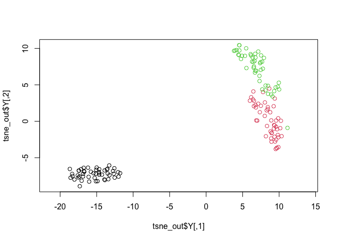

<!-- README.md is generated from README.Rmd. Please edit that file -->

[](https://cran.r-project.org/package=Rtsne/)
[](https://travis-ci.org/jkrijthe/Rtsne)
[](https://codecov.io/github/jkrijthe/Rtsne?branch=master)
[](https://cran.r-project.org/package=Rtsne/)

# R wrapper for Van der Maaten’s Barnes-Hut implementation of t-Distributed Stochastic Neighbor Embedding

## Installation

To install from CRAN:

``` r
install.packages("Rtsne") # Install Rtsne package from CRAN
```

To install the latest version from the github repository,
use:

``` r
if(!require(devtools)) install.packages("devtools") # If not already installed
devtools::install_github("jkrijthe/Rtsne")
```

## Usage

After installing the package, use the following code to run a simple
example (to install, see below).

``` r
library(Rtsne) # Load package
iris_unique <- unique(iris) # Remove duplicates
set.seed(42) # Sets seed for reproducibility
tsne_out <- Rtsne(as.matrix(iris_unique[,1:4])) # Run TSNE
plot(tsne_out$Y,col=iris_unique$Species,asp=1) # Plot the result
```

<!-- -->

# Details

This R package offers a wrapper around the Barnes-Hut TSNE C++
implementation of \[2\] \[3\]. Changes were made to the original code to
allow it to function as an R package and to add additional functionality
and speed improvements.

# References

\[1\] L.J.P. van der Maaten and G.E. Hinton. Visualizing
High-Dimensional Data Using t-SNE. Journal of Machine Learning Research
9(Nov):2579-2605, 2008.

\[2\] L.J.P. van der Maaten. Barnes-Hut-SNE. In Proceedings of the
International Conference on Learning Representations, 2013.

\[3\] <http://homepage.tudelft.nl/19j49/t-SNE.html>
